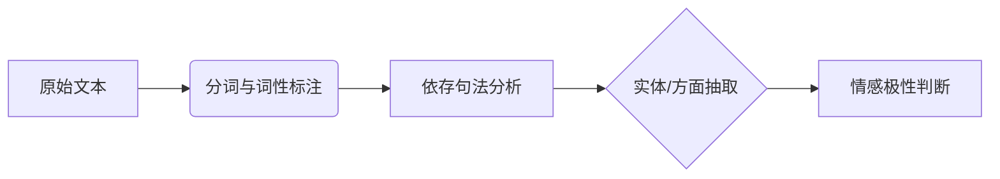

以下是针对《情感分析》课件的系统化讲解，我将按照初学者的理解路径分模块拆解核心概念，并配合具体案例说明：

---

### **一、情感分析基础概念**
#### 1. 定义与意义
- **原文**：  
  "Computational study of opinions and sentiments expressed in text"  
  **翻译**：  
  "对文本中表达的观点和情感的计算研究"  
  **讲解**：  
  情感分析是通过算法自动识别文本中的主观态度（如好评/差评）。例如：  
  - 应用场景：电商评论（"手机屏幕很棒但电池差"）、社交媒体舆情监控。

#### 2. 核心五元组模型
- **原文**：  
  "An opinion is a quintuple, \( (e_i, a_{ij}, oo_{ijkl}, h_k, t_l) \)"  
  **翻译**：  
  "一个观点可用五元组表示：\( (实体, 方面, 情感倾向, 观点持有者, 时间) \)"  
  **案例拆解**：  
  句子："2023年John觉得iPhone的摄像头很出色"  
  - 实体（\( e_i \)）：iPhone  
  - 方面（\( a_{ij} \)）：摄像头  
  - 情感倾向（\( oo_{ijkl} \)）：正面  
  - 观点持有者（\( h_k \)）：John  
  - 时间（\( t_l \)）：2023年

---

### **二、四大核心任务详解**
#### 任务1：实体抽取（Entity Extraction）
- **方法**：  
  - 规则匹配：通过产品名称关键词（如"Nokia"、"Moto"）  
  - 指代消解：处理代词（如"her phone"指代前文的"Nokia"）  
  **案例**：  
  "我的Moto手机通话不清楚" → 实体："Motorola"

#### 任务2：方面抽取（Aspect Extraction）
- **技术手段**：  
  - **词性标注**：提取名词/名词短语（如"touch screen"）  
  - **依存分析**：通过语法关系定位方面词  
    ```python
    # 例句："The pictures are absolutely amazing"
    # 依存关系：amazing → amod → pictures
    # 提取方面词："pictures"
    ```

#### 任务3：观点持有者与时间抽取
- **关键点**：  
  - 显式持有者：第一人称（"I"）、第三人称（"my girlfriend"）  
  - 时间戳：发布时间（"Nov-4-2010"）或上下文时间（"yesterday"）

#### 任务4：方面情感分类
- **方法对比**：  
  | 方法类型 | 代表算法 | 适用场景 |  
  |---|---|---|  
  |监督学习|SVM/神经网络|标注数据充足时|  
  |词典匹配|情感词库（如"good"=+1分）|冷启动阶段|  

---

### **三、技术实现流程**
#### 1. NLP处理流水线


#### 2. 依存关系规则示例
- **规则模板**：  
  "形容词 → amod → 名词" → 提取名词作为方面  
  **实例**：  
  "清晰的声音质量" → "声音质量"（方面）+ "清晰"（正面）

#### 3. 情感计算模型
- **词典法公式**：  
  \( \text{情感得分} = \sum_{w \in \text{句子}} \text{极性}(w) \)  
  - 例如："屏幕[+1]一般[0]但电池[-1]差" → 总分0

---

### **四、典型挑战与解决方案**
1. **否定处理**：  
   - 问题："电池不算差"  
   - 解法：加入否定词规则（"不算"反转极性）

2. **隐式方面**：  
   - 问题："太重了"（隐含"重量"方面）  
   - 解法：构建方面同义词库（"重"→"重量"）

3. **跨语言分析**：  
   - 中文特性："性价比高"需分词后组合分析

---

### **五、学习建议**
1. **工具实践**：  
   - 使用NLTK/spaCy实现基础情感分析  
   ```python
   import spacy
   nlp = spacy.load("en_core_web_sm")
   doc = nlp("The camera is amazing but battery drains fast")
   for token in doc:
       print(token.text, token.pos_, token.dep_)
   ```

2. **数据集**：  
   - 英文：IMDB影评  
   - 中文：京东商品评论

3. **延伸阅读**：  
   - 刘兵《Web数据挖掘》第11章（课件末推荐）

需要任何模块的深度展开或代码演示，请随时告知！
